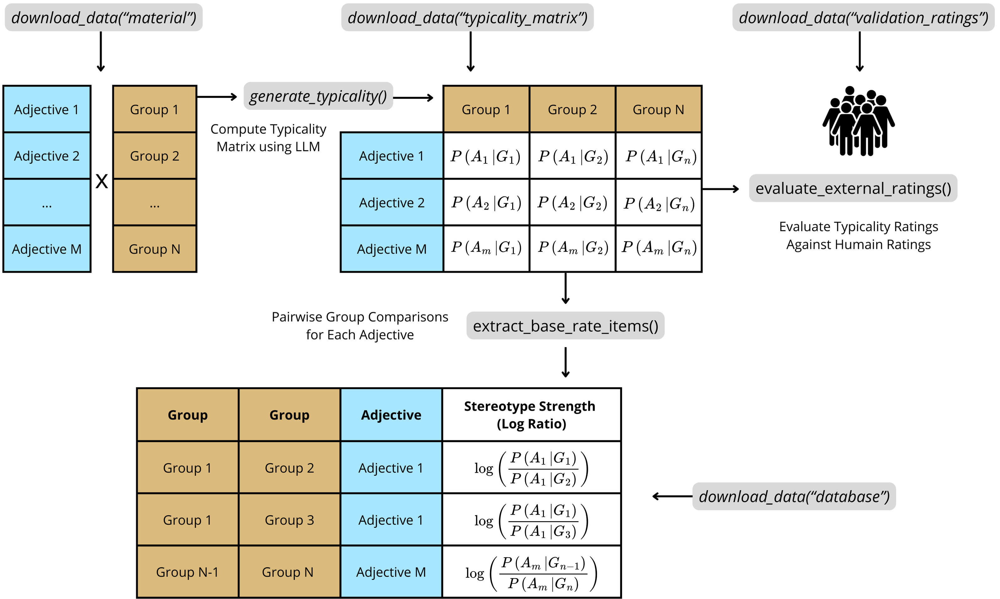

The `baserater` package allows to:  

- Download LLM‑generated base-rate item datasets and human validation ratings from the original paper.  
- Generate new typicality scores with any Hugging Face model.  
- Benchmark new scores against human ground truth, and compare performance against strong LLM baselines.  
- Build base‑rate items database from typicality matrices.

It is designed to streamline the creation of base-rate neglect items for reasoning experiments. A base-rate neglect item typically involves two groups (e.g., "engineers" and "construction workers") and a descriptive trait (e.g., "nerdy"). Participants are presented with statistical information (base-rates; e.g., "There are 995 construction workers and 5 engineers") and stereotypical information (the descriptive trait). Their task is to decide the most likely group membership of an individual described by that trait. The "typicality rating" generated by large language models quantifies how strongly certain traits (e.g., "nerdy," "kind") or descriptions are (stereo)typically associated with specific groups (e.g., engineers, nurses). This allows researchers to precisely measure and control "stereotype strength"–the extent to which a given description is perceived as belonging more strongly to one group over another (e.g., the trait "nerdy" is typically seen as more characteristic of engineers than of construction workers).

The full documentation along with a tutorial is available at: https://jeremie-beucler.github.io/baserater/

To learn more about the theoretical framework and studies underlying the baserater package, see the paper: *Using Large Language Models to Estimate Belief Strength in Reasoning* (Beucler et al., forthcoming).

```{r, include = FALSE}
knitr::opts_chunk$set(
  collapse = TRUE,
  comment  = "#>",
  message  = FALSE
)
```

## Installation

To install the latest development version from GitHub, run:

```{r}
# install.packages("pak")  # if not yet installed
pak::pak("Jeremie-Beucler/baserater")
```

## Citation

Please cite the package as:

Beucler, J. (2025). baserater: An R package using large language models to estimate belief strength in reasoning. Github. https://jeremie-beucler.github.io/baserater/


## Package overview

<br>


<br>

*Schematic overview of the `baserater` package.*

## License

GPL-3

## Hugging Face Resources

Hugging Face is a platform that provides access to a wide range of pre-trained models and datasets for natural language processing (NLP) tasks. The `baserater` package uses Hugging Face's API to generate typicality scores with various models. Here are some useful resources to get started with Hugging Face:

- [Create a Hugging Face access token](https://huggingface.co/settings/tokens) — Required to authenticate API requests to hosted models.  
- [Hugging Face Inference Endpoints](https://huggingface.co/docs/inference-endpoints) — Set up and deploy your own scalable model endpoint directly through Hugging Face.  
- [Hugging Face Inference Providers](https://huggingface.co/docs/inference-providers) — Use third-party infrastructure (e.g., AWS, Azure, Paperspace) to serve and scale models.  
- [Hugging Face Model Hub](https://huggingface.co/models) — Browse available models (e.g., LLaMA, Mixtral) and view license requirements.  
