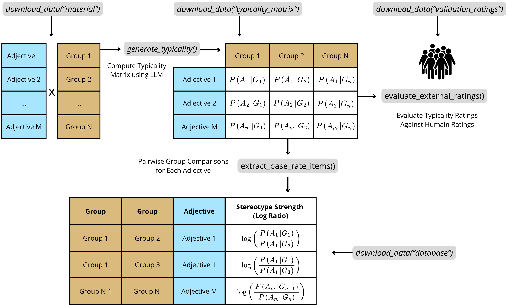

The `baserater` package allows to:  

- Download LLM‑generated base-rate item datasets and human validation ratings from the original paper.  
- Generate new typicality scores with any Hugging Face model.  
- Benchmark new scores against human ground truth, and compare performance against strong LLM baselines.  
- Build base‑rate items database from typicality matrices.

It is designed to streamline the creation of base-rate neglect items for reasoning experiments. A base-rate neglect item typically involves two groups (e.g., "engineers" and "construction workers") and a descriptive trait (e.g., "nerdy"). Participants are presented with statistical information (base-rates; e.g., "There are 995 construction workers and 5 engineers") and stereotypical information (the descriptive trait). Their task is to decide the most likely group membership of an individual described by that trait. The "typicality rating" generated by large language models quantifies how strongly certain traits (e.g., "nerdy," "kind") or descriptions are (stereo)typically associated with specific groups (e.g., engineers, nurses). This allows researchers to precisely measure and control "stereotype strength"–the extent to which a given description is perceived as belonging more strongly to one group over another (e.g., the trait "nerdy" is typically seen as more characteristic of engineers than of construction workers).

The full documentation along with a tutorial is available at: https://jeremie-beucler.github.io/baserater/

To learn more about the theoretical framework and studies underlying the baserater package, see the paper: *Using Large Language Models to Estimate Belief Strength in Reasoning* (Beucler et al., forthcoming).

```{r, include = FALSE}
knitr::opts_chunk$set(
  collapse = TRUE,
  comment  = "#>",
  message  = FALSE
)
```

## Installation

To install the latest development version from GitHub, run:

```{r}
# install.packages("pak")  # if not yet installed
pak::pak("Jeremie-Beucler/baserater")
```

## Citation

Please cite the package as:

Beucler, J. (2025). *baserater: An R package using large language models to estimate belief strength in reasoning* (Version 0.1.0) [Computer software]. Zenodo. https://doi.org/10.5281/zenodo.15449192


## Package overview

<br>


<br>

*Schematic overview of the `baserater` package.*

## License

MIT

## Inference Provider Resources

The `baserater` package can connect to various inference providers such as Together AI, Hugging Face Inference, Fireworks, and Replicate.  
These platforms host or serve large language models and allow you to query them through a standard OpenAI-style `chat/completions` API.

Here are some useful resources to get started:

- [Together AI](https://api.together.xyz/);
- [Hugging Face Inference Endpoints](https://huggingface.co/docs/inference-endpoints);
- [Fireworks AI](https://fireworks.ai/);
- [Replicate](https://replicate.com/).

Before generating new scores using the `generate_typicality()` function, make sure you have completed the following setup steps:

- **Obtain your provider’s API URL and token:**  
  You can pass them directly to the function or store them as environment variables in R, for example:  
  `Sys.setenv(PROVIDER_API_URL = "https://api.together.xyz/v1/chat/completions")`  
  `Sys.setenv(PROVIDER_API_TOKEN = "your_secret_token")`

- **Check model availability and license terms:**  
  Some models require that you accept license terms before use. Check your provider’s model catalog for details.

- **Verify the correct model name for your provider:**  
  Model identifiers can differ between providers (for example, `"meta-llama/Llama-3.3-70B-Instruct-Turbo"` on Together AI vs. `"meta-llama/Llama-3.3-70B-Instruct"` on Hugging Face).  
  Always use the exact model name listed in your provider’s documentation.
